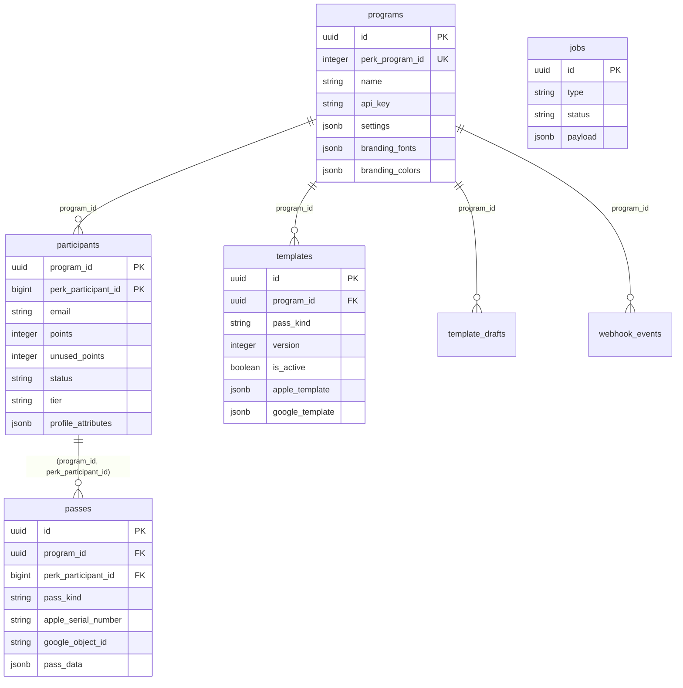

# Perk Wallet

A Next.js application for issuing and managing Apple Wallet and Google Wallet passes for Perk loyalty programs with complete multi-program support and enterprise-grade admin interface.

## What This Is

Perk Wallet bridges Perk loyalty programs with mobile wallet platforms (Apple Wallet and Google Wallet), automatically generating dynamic wallet passes that update in real-time based on participant activity. Built for enterprise deployment with multi-tenant architecture, role-based access control, and comprehensive admin tooling.

**Key Capabilities:**

- **Universal Install Routes**: `pass.perk.ooo/w/44/246785` generates wallet passes for any participant
- **Real-time Updates**: Wallet passes sync within 60 seconds of Perk events via webhooks
- **Multi-Program Support**: Complete data isolation and custom branding per program
- **Enterprise Admin**: Role-based dashboard with diagnostics, participant management, and template editing
- **Dual Platform**: Simultaneous Apple Wallet (`.pkpass`) and Google Wallet pass generation

## Tech Stack

- **Framework**: Next.js 15 App Router + TypeScript
- **Database**: Supabase PostgreSQL + Storage
- **UI**: shadcn/ui + Tailwind CSS + Radix UI
- **Deployment**: Vercel (auto-deploy from main)
- **Runtime**: Node.js 20+
- **Validation**: Zod schemas throughout
- **Wallet APIs**: passkit-generator (Apple), Google Wallet REST API

## Quick Start

### 1. Prerequisites

```bash
# Required tools
node --version  # 20+
pnpm --version  # 8+

# Required accounts
# - Supabase project
# - Apple Developer account (for Apple Wallet)
# - Google Cloud account (for Google Wallet)
# - Perk API credentials
```

### 2. Clone and Install

```bash
git clone https://github.com/your-org/perk-wallet.git
cd perk-wallet
pnpm install
```

### 3. Environment Setup

```bash
cp .env.example .env.local
# Edit .env.local with your credentials (see ENV.md for details)
```

### 4. Database Setup

```bash
# Run Supabase migrations
npx supabase db push

# Or apply manually from supabase/migrations/
```

### 5. Start Development

```bash
pnpm dev
# Visit http://localhost:3000
```

### 6. Access Admin Interface

```bash
# 1. Set admin secret in .env.local
APP_EMULATOR_SECRET=your-secure-secret

# 2. Visit role emulator
open http://localhost:3000/admin/emulator

# 3. Select "Super Admin" → Impersonate
# 4. Access full admin at /admin
```

## Identity Model

Perk Wallet uses a **composite key architecture** that keeps internal implementation details private while exposing clean public interfaces.

### Core Concept

- **Internal**: Programs use UUID primary keys (`programs.id`)
- **Public**: Routes use Perk Program IDs (`programs.perk_program_id`)
- **Participants**: Composite key `(program_id UUID, perk_participant_id bigint)`

### Examples

```bash
# Public install route (uses Perk Program ID)
/w/44/246785  # Program 44, Participant 246785

# Admin redirect (Perk Program ID → UUID)
/admin/p/44 → /admin/programs/3648cab8-a29f-4d13-9160-f1eab36e88bd

# QR code format
44.246785.loyalty  # programId.participantId.passKind
```

### Database Schema



## Routes Overview

### Public Install Routes

```bash
# Universal install (default pass group)
GET /w/{perkProgramId}/{perkParticipantId}

# Specific pass type
GET /w/{perkProgramId}/{perkParticipantId}/{passKind}

# With resource context (QR codes)
GET /w/{perkProgramId}/{perkParticipantId}/{passKind}/{resourceType}/{resourceId}
```

### Admin Routes

```bash
# Admin redirect (Perk Program ID → UUID)
GET /admin/p/{perkProgramId}

# Core admin pages
GET /admin                    # Dashboard
GET /admin/programs           # Program management
GET /admin/templates          # Template editor
GET /admin/participants       # Legacy redirect (moved to program context)
GET /admin/programs/{programId}/participants/{perkParticipantId}  # Participant details
GET /admin/passes             # Wallet pass monitoring
GET /admin/jobs               # Background jobs
GET /admin/webhooks           # Event history
```

### API Routes

```bash
# Diagnostics
POST /api/admin/diagnostics/install    # System health checks

# Webhooks (per-program)
POST /api/webhooks/perk/{perkProgramId}

# Pass management
PATCH /api/passes/{perkProgramId}/{perkParticipantId}

# Apple Wallet Web Service
GET /api/apple-web-service/v1/passes/{passTypeIdentifier}/{serialNumber}
POST /api/apple-web-service/v1/devices/{deviceId}/registrations/{passTypeId}/{serialNumber}
```

## Template Studio

### Current Features (v0.6.0)

- ✅ **Template Drafts**: Program-scoped draft management
- ✅ **Multi-tab Editor**: Layout, Fields, Assets, Preview tabs
- ✅ **Asset Upload**: Supabase Storage integration (5 asset types)
- ✅ **Merge Tags**: 16+ dynamic content tags with validation
- ✅ **Preview API**: Real participant data resolution
- ✅ **Field Mapping**: Visual editor with autocomplete

### Merge Tags

```bash
# Participant data
{points}              # Total lifetime points
{unused_points}       # Available balance
{email}               # Email address
{fname} {lname}       # First/last name
{full_name}           # Combined name
{tier} {status}       # Tier or status

# Program context
{program_name}        # Program name
{perk_participant_id} # Participant ID

# Custom attributes
{profile.seat_section}  # Profile attributes
{profile.favorite_team} # Dynamic profile data

# Notification-specific
{points_delta}        # Points change (+25)
{new_points}          # New balance after change
```

### Planned Features

- 🔄 **Live Device Previews**: Real wallet frame rendering
- 🔄 **Template Publishing**: Draft → template workflow
- 🔄 **Pass Regeneration**: Auto-update passes when templates change
- 🔄 **Apple Class Creation**: Auto-generate Apple pass classes

## Diagnostics

Test system readiness with the diagnostics API:

```bash
curl -X POST "http://localhost:3000/api/admin/diagnostics/install" \
  -H "Content-Type: application/json" \
  -d '{
    "perk_program_id": 44,
    "perk_participant_id": 246785,
    "kinds": ["loyalty", "rewards"]
  }'
```

**Expected Response:**

```json
{
  "ok": true,
  "participant": { "exists": true },
  "checks": [
    {
      "kind": "loyalty",
      "published_template": true,
      "apple_ready": true,
      "google_ready": true,
      "qr_preview": "44.246785.loyalty",
      "issues": []
    }
  ]
}
```

## Deploy to Vercel

### 1. Connect Repository

1. Import your GitHub repo to Vercel
2. Framework preset: **Next.js**
3. Root directory: **.**

### 2. Environment Variables

Add all variables from `.env.example` to Vercel dashboard:

```bash
# Required in Vercel
NEXT_PUBLIC_SUPABASE_URL
NEXT_PUBLIC_SUPABASE_ANON_KEY
SUPABASE_SERVICE_ROLE_KEY
PERK_API_KEY
PERK_WEBHOOK_SECRET
QR_SIGNING_SECRET
APP_EMULATOR_SECRET
# ... plus Apple/Google wallet credentials
```

### 3. Deploy

```bash
vercel --prod
```

### 4. Configure Webhooks

Update your Perk program settings with webhook URL:

```
https://your-domain.vercel.app/api/webhooks/perk/{perkProgramId}
```

## Concepts at a Glance

- ✅ **Dual addressing**: UUIDs internal, Perk Program IDs at edges
- ✅ **Composite identity**: (program_id, perk_participant_id) replaces perk_uuid
- ✅ **Multi-tenant**: Complete program data isolation
- ✅ **Real-time sync**: Webhook → pass update within 60 seconds
- ✅ **Enterprise admin**: RBAC with 5 roles, comprehensive management
- ✅ **Template studio**: Draft management, merge tags, asset uploads
- ✅ **Notification merging**: 120s merge window, 300s throttling
- ✅ **QR grammar**: `programId.participantId.passKind[.resourceType.resourceId]`
- ✅ **Diagnostics**: Health checks for certificates, templates, participants
- ✅ **Version tracking**: Git commit display, deployment verification

## Documentation

- [Architecture Overview](./docs/ARCHITECTURE.md) - System design and request flow
- [Routes Reference](./docs/ROUTES.md) - Complete API and route documentation
- [Identity Model](./docs/IDENTITY.md) - Composite key architecture details
- [Template Studio](./docs/TEMPLATE_STUDIO.md) - Template system guide
- [Operations Guide](./docs/OPERATIONS.md) - Admin tasks and troubleshooting
- [Environment Variables](./docs/ENV.md) - Complete environment reference

## Current Version: v0.6.0

**Identity model locked** ✅ Diagnostics and install routes verified ✅ Templates published for program 44 ✅

See [CHANGELOG.md](./CHANGELOG.md) for version history and [STATE.md](./STATE.md) for current development status.

---

**Production URL**: https://pass.perk.ooo  
**Repository**: [GitHub](https://github.com/your-org/perk-wallet)  
**Documentation**: [Docs](./docs/)  
**Support**: [Issues](https://github.com/your-org/perk-wallet/issues)
