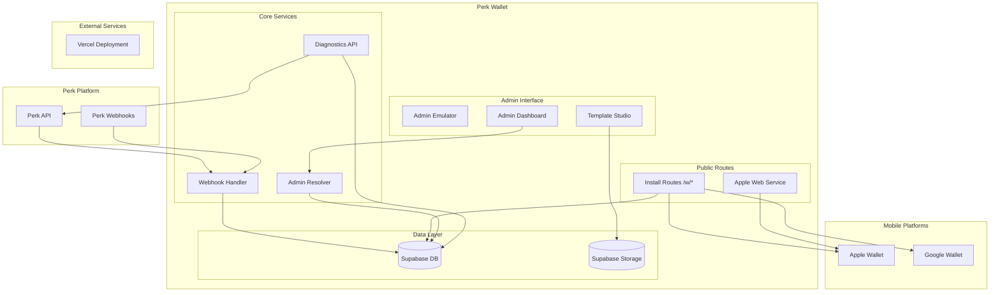

# Architecture Overview

High-level system design and request flow patterns for Perk Wallet.

## System Components



## Request Flow Patterns

### 1. Install Route Flow

```
User clicks: pass.perk.ooo/w/44/246785
    ↓
1. Route resolves Perk Program ID 44 → Internal UUID
2. Validates participant 246785 exists in program
3. Fetches program's default install group (loyalty, rewards)
4. Issues Apple Wallet .pkpass file
5. Issues Google Wallet pass
6. Returns installation response
```

### 2. Admin Resolver Flow

```
Admin visits: /admin/p/44
    ↓
1. Program resolver: 44 → 3648cab8-a29f-4d13-9160-f1eab36e88bd
2. 307 redirect to: /admin/programs/3648cab8-a29f-4d13-9160-f1eab36e88bd
3. Admin page loads with UUID-based internal routes
4. All subsequent admin operations use internal UUID
```

### 3. Diagnostics API Flow

```
POST /api/admin/diagnostics/install
Body: { perk_program_id: 44, perk_participant_id: 246785 }
    ↓
1. Resolve program 44 → internal UUID
2. Check participant exists with composite key
3. Validate Apple/Google certificates
4. Check template publication status
5. Generate QR preview: "44.246785.loyalty"
6. Return comprehensive health check
```

### 4. Webhook Processing Flow

```
Perk Platform: POST /api/webhooks/perk/44
Body: { event: "participant_points_updated", data: {...} }
    ↓
1. Validate webhook signature (HMAC-SHA256)
2. Resolve program 44 → internal UUID
3. Generate idempotency key from payload
4. Parse event with Perk schema validation
5. Upsert participant with composite key
6. Queue notification events (with merging)
7. Update wallet passes via Apple/Google APIs
8. Track event in webhook_events table
```

## Security Architecture

### Environment Variable Separation

```typescript
// Public (NEXT_PUBLIC_*) - Safe for client
NEXT_PUBLIC_SUPABASE_URL;
NEXT_PUBLIC_SUPABASE_ANON_KEY;
NEXT_PUBLIC_APP_URL;

// Server-only - Never sent to client
SUPABASE_SERVICE_ROLE_KEY;
PERK_API_KEY;
PERK_WEBHOOK_SECRET;
QR_SIGNING_SECRET;
APPLE_PASS_CERT_P12_BASE64;
APPLE_PASS_CERT_PASSWORD;
GOOGLE_WALLET_SERVICE_ACCOUNT_KEY;
APP_EMULATOR_SECRET;
```

### Role-Based Access Control

```typescript
// Permission hierarchy (high → low)
super_admin    → All programs, all actions
program_admin  → Single program, all actions
program_editor → Single program, edit templates/passes
program_viewer → Single program, read-only
support        → Limited write (reissue, resend)
```

### Data Isolation

- **Programs**: Complete data isolation via `program_id` foreign keys
- **Admin Scope**: Non-super-admin users see only their assigned program(s)
- **API Keys**: Program-specific, stored server-side only
- **Branding**: Per-program assets and configuration

## Data Flow Architecture

### Composite Key Strategy

```sql
-- Primary identity
participants (
  program_id UUID,          -- Internal program reference
  perk_participant_id BIGINT -- Perk's participant ID
) PRIMARY KEY

-- Foreign key relationships
passes (
  program_id UUID,
  perk_participant_id BIGINT,
  FOREIGN KEY (program_id, perk_participant_id)
    REFERENCES participants(program_id, perk_participant_id)
)
```

### Dual Addressing Pattern

```typescript
// Public routes use Perk Program IDs
/w/44/246785 → program lookup by perk_program_id

// Admin routes use internal UUIDs
/admin/programs/3648cab8-a29f-4d13-9160-f1eab36e88bd

// Resolver bridges the gap
resolveProgram(44) → {
  program: { id: "3648cab8-...", perk_program_id: 44 },
  reason: "by_perk_id"
}
```

## Background Processing

### Notification Merging

```typescript
// Merge window: 120 seconds
Event 1: +5 points at 10:00:00
Event 2: +5 points at 10:00:30
Event 3: +5 points at 10:01:45
    ↓
Single notification: "You gained +15 points!"
```

### Job Queue System

```typescript
interface Job {
  type: "notification" | "pass_update" | "webhook_retry";
  status: "pending" | "running" | "completed" | "failed";
  payload: Record<string, unknown>;
  attempts: number;
  scheduled_at: string;
}
```

## Template Studio Architecture

### Draft Management

```
template_drafts/
├── program_id (UUID)
├── pass_kind ('loyalty' | 'rewards')
├── layout (JSONB)
├── assets (JSONB)
└── based_on_template (UUID, nullable)
```

### Asset Storage Structure

```
pass-assets/
└── programs/
    └── {program-uuid}/
        └── drafts/
            └── {draft-uuid}/
                └── {asset-uuid}/
                    └── filename.png
```

### Preview Resolution

```typescript
// Template with merge tags
layout: {
  headerFields: [
    {
      label: "Balance",
      value: "{unused_points} points",
    },
  ];
}

// Resolved with participant data
layout: {
  headerFields: [
    {
      label: "Balance",
      value: "750 points", // {unused_points} → 750
    },
  ];
}
```

## Performance Considerations

### Database Queries

- **Composite indexes** on `(program_id, perk_participant_id)`
- **Program scoping** prevents cross-program data leaks
- **Supabase RLS** policies for additional security
- **Connection pooling** via Supabase built-in pool

### Caching Strategy

- **Static assets** cached at CDN level (Vercel)
- **Template previews** cached in-memory during editing
- **Apple/Google passes** regenerated only on data changes
- **Admin queries** use fresh data (no stale permissions)

### Scalability

- **Multi-tenant by design** - unlimited programs
- **Webhook idempotency** prevents duplicate processing
- **Background job queue** for async operations
- **Vercel serverless** scales automatically with traffic
