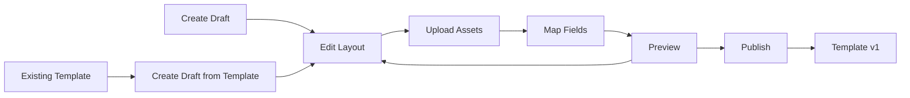

# Template Studio

Complete guide to the template editing system, merge tags, and preview functionality.

## Overview

Template Studio provides a comprehensive editing environment for wallet pass templates with real-time preview, asset management, and dynamic content via merge tags.

## Current Features (v0.6.0)

### ✅ Template Drafts System

- **Program-scoped management**: Each program has independent draft space
- **Draft versioning**: Drafts can be based on existing templates
- **Isolation**: Complete separation between programs
- **Persistence**: Auto-save during editing sessions

### ✅ Multi-tab Editor Interface

- **Layout Tab**: JSON editor with syntax highlighting and validation
- **Fields Tab**: Visual field mapping with autocomplete
- **Assets Tab**: File upload and management interface
- **Preview Tab**: Real-time preview with participant data
- **Publish Tab**: Template publishing workflow (planned)

### ✅ Asset Upload System

- **5 Asset Types**: logo, icon, strip, background, googleCover
- **Supabase Storage**: Organized in `pass-assets` bucket
- **File Validation**: PNG, JPG, JPEG, WebP up to 5MB
- **Replace/Remove**: Full asset lifecycle management

### ✅ Merge Tags (16+ Dynamic Tags)

- **Participant Data**: `{points}`, `{unused_points}`, `{email}`, `{fname}`, `{lname}`
- **Program Context**: `{program_name}`, `{perk_participant_id}`
- **Custom Attributes**: `{profile.seat_section}`, `{profile.favorite_team}`
- **Notification-specific**: `{points_delta}`, `{new_points}`

### ✅ Preview API

- **Real Participant Data**: Resolves with actual participant records
- **Fallback System**: Mock data when participant not found
- **Deep Resolution**: Traverses nested objects to replace tags
- **Validation**: Detects unknown tags and validation errors

### ✅ Field Mapping UI

- **Visual Editor**: Common template fields with autocomplete
- **Apply to Layout**: Direct integration with layout JSON
- **Reference Panel**: Shows all available merge tags
- **Validation**: Real-time validation of field values

## Template Draft Management

### Database Schema

```sql
CREATE TABLE template_drafts (
  id UUID PRIMARY KEY DEFAULT gen_random_uuid(),
  program_id UUID NOT NULL REFERENCES programs(id) ON DELETE CASCADE,
  pass_kind TEXT NOT NULL CHECK (pass_kind IN ('loyalty', 'rewards', 'coupon', 'ticket', 'stamp', 'giftcard', 'id')),
  based_on_template UUID REFERENCES templates(id),
  layout JSONB NOT NULL DEFAULT '{}',
  assets JSONB NOT NULL DEFAULT '{}',
  created_at TIMESTAMPTZ DEFAULT NOW(),
  updated_at TIMESTAMPTZ DEFAULT NOW()
);
```

### Draft Lifecycle



### API Endpoints

```typescript
// List drafts for program
GET /admin/programs/{programId}/templates

// Create new draft
POST /admin/programs/{programId}/templates
{
  "pass_kind": "loyalty",
  "based_on_template": "uuid-or-null"
}

// Edit draft
GET /admin/programs/{programId}/templates/{draftId}
PATCH /admin/programs/{programId}/templates/{draftId}
{
  "layout": { /* JSON layout */ },
  "assets": { /* asset references */ }
}
```

## Asset Management

### Storage Structure

```
pass-assets/
└── programs/
    └── {program-uuid}/
        └── drafts/
            └── {draft-uuid}/
                └── {asset-uuid}/
                    └── filename.png
```

### Supported Asset Types

```typescript
type AssetType =
  | "logo" // Program logo (160x50px recommended)
  | "icon" // App icon (57x57px required)
  | "strip" // Strip image (640x84px)
  | "background" // Background image (640x1136px)
  | "googleCover"; // Google Wallet cover (1032x336px)
```

### Upload Workflow

```typescript
// 1. User selects file
const file = event.target.files[0];

// 2. Validate file
if (!["image/png", "image/jpeg", "image/webp"].includes(file.type)) {
  throw new Error("Invalid file type");
}
if (file.size > 5 * 1024 * 1024) {
  throw new Error("File too large (max 5MB)");
}

// 3. Upload to Supabase Storage
const { data, error } = await supabase.storage
  .from("pass-assets")
  .upload(
    `programs/${programId}/drafts/${draftId}/${assetId}/${file.name}`,
    file,
  );

// 4. Update draft assets
await supabase
  .from("template_drafts")
  .update({
    assets: {
      ...draft.assets,
      [assetType]: {
        filename: file.name,
        path: data.path,
        size: file.size,
        uploaded_at: new Date().toISOString(),
      },
    },
  })
  .eq("id", draftId);
```

## Merge Tags System

### Core Tags

```typescript
// Participant information
{
  points;
} // Total lifetime points: "1,250"
{
  unused_points;
} // Available balance: "750"
{
  email;
} // Email address: "user@example.com"
{
  fname;
} // First name: "John"
{
  lname;
} // Last name: "Doe"
{
  full_name;
} // Combined name: "John Doe"
{
  tier;
} // Tier level: "Gold"
{
  status;
} // Participant status: "Active"

// Program context
{
  program_name;
} // Program name: "Buckeye Nation Rewards"
{
  perk_participant_id;
} // Participant ID: "246785"

// Custom profile attributes
{
  profile.seat_section;
} // "Section A"
{
  profile.favorite_team;
} // "Ohio State"
{
  profile.birthday;
} // "1990-01-15"

// Notification-specific (for notifications only)
{
  points_delta;
} // Points change: "+25"
{
  new_points;
} // New balance: "1,275"
```

### Tag Resolution Process

```typescript
// 1. Find all merge tags in template
const tags = findMergeTags(template);
// → ["{points}", "{unused_points}", "{profile.seat_section}"]

// 2. Resolve each tag with participant data
for (const tag of tags) {
  if (tag === "{points}") {
    value = formatNumber(participant.points);
  } else if (tag.startsWith("{profile.")) {
    const key = extractAttrKey(tag); // "seat_section"
    value = participant.profile_attributes[key] || "";
  }
  // Replace in template
  template = template.replace(new RegExp(escapeRegExp(tag), "g"), value);
}
```

### Custom Attribute Tags

```typescript
// Profile attribute access
{
  profile.KEY;
} // Access participant.profile_attributes.KEY

// Examples from real data
{
  profile.seat_section;
} // Stadium seating
{
  profile.favorite_color;
} // User preference
{
  profile.membership_date;
} // Join date
{
  profile.phone_number;
} // Contact info
```

### Tag Validation

```typescript
// Unknown tags detection
const unknownTags = findMergeTags(template).filter(
  (tag) => !SUPPORTED_TAGS.includes(tag) && !isDynamicAttr(tag),
);

if (unknownTags.length > 0) {
  console.warn("Unknown merge tags:", unknownTags);
  // Show warning in admin UI
}
```

## Preview System

### Preview API Endpoint

```http
POST /api/admin/templates/preview
```

**Request:**

```json
{
  "program_id": "3648cab8-a29f-4d13-9160-f1eab36e88bd",
  "draft_id": "draft-uuid-here",
  "participant": {
    "perk_participant_id": 246785,
    "email": "user@example.com" // Optional for specific lookup
  }
}
```

**Response:**

```json
{
  "resolved_layout": {
    "headerFields": [
      {
        "label": "Balance",
        "value": "750 points" // {unused_points} resolved
      }
    ],
    "primaryFields": [
      {
        "label": "Member",
        "value": "John Doe" // {full_name} resolved
      }
    ]
  },
  "participant_data": {
    "found": true,
    "source": "database" // or "mock"
  }
}
```

### Participant Data Resolution

```typescript
// 1. Try to find real participant
const participant = await getSampleParticipant(programId, {
  perk_participant_id: 246785,
  email: "user@example.com",
});

// 2. Fallback to mock data if not found
if (!participant) {
  participant = {
    perk_participant_id: 246785,
    email: "john.doe@example.com",
    fname: "John",
    lname: "Doe",
    points: 1250,
    unused_points: 750,
    status: "Active",
    tier: "Gold",
    profile_attributes: {
      favorite_color: "Blue",
      seat_section: "Section A",
    },
  };
}

// 3. Resolve template with participant data
const resolved = resolveLayoutForPreview(draft.layout, {
  participant,
  program,
});
```

## Field Mapping Interface

### Visual Field Editor

```typescript
interface FieldMapping {
  headerFields: {
    label: string;
    value: string; // Can contain merge tags
  }[];
  primaryFields: {
    label: string;
    value: string;
  }[];
  secondaryFields: {
    label: string;
    value: string;
  }[];
  auxiliaryFields: {
    label: string;
    value: string;
  }[];
  backFields: {
    label: string;
    value: string;
  }[];
}
```

### Autocomplete System

```typescript
const MERGE_TAG_SUGGESTIONS = [
  {
    label: "Points Balance",
    value: "{unused_points}",
    description: "Available points to spend",
  },
  {
    label: "Total Points",
    value: "{points}",
    description: "Lifetime points earned",
  },
  {
    label: "Member Name",
    value: "{full_name}",
    description: "First and last name",
  },
  {
    label: "Email Address",
    value: "{email}",
    description: "Participant email",
  },
  { label: "Tier Level", value: "{tier}", description: "Current tier status" },
  {
    label: "Program Name",
    value: "{program_name}",
    description: "Program display name",
  },
  // ... custom attributes
  {
    label: "Seat Section",
    value: "{profile.seat_section}",
    description: "Stadium seating section",
  },
];
```

### Apply to Layout Workflow

```typescript
// User edits field in visual editor
const fieldMapping = {
  headerFields: [{ label: "Balance", value: "{unused_points} points" }],
};

// "Apply to Layout" button pressed
const updatedLayout = {
  ...draft.layout,
  headerFields: fieldMapping.headerFields,
};

// Save to draft
await updateDraft(draftId, { layout: updatedLayout });
```

## Template Publishing

### Planned Features (v0.7.0+)

- 🔄 **Publish Workflow**: Convert drafts to versioned templates
- 🔄 **Version Management**: Bump template versions (v1, v2, v3...)
- 🔄 **Impact Analysis**: Show which passes will be affected
- 🔄 **Rollback Support**: Revert to previous template versions
- 🔄 **A/B Testing**: Deploy templates to subsets of participants

### Future Publishing API

```typescript
// Publish draft as new template version
POST /api/admin/templates/publish
{
  "draft_id": "draft-uuid",
  "version_type": "major" | "minor" | "patch",
  "notes": "Updated with new branding assets"
}

// Response
{
  "template": {
    "id": "template-uuid",
    "version": 2,
    "pass_kind": "loyalty",
    "is_active": true
  },
  "impact": {
    "affected_passes": 1247,
    "regeneration_required": true
  }
}
```

## Live Device Previews

### Planned Features (v0.7.0+)

- 🔄 **Apple Wallet Frame**: Render preview in actual iOS wallet UI
- 🔄 **Google Wallet Frame**: Render preview in Android wallet UI
- 🔄 **Device Simulation**: iPhone/Android device frames
- 🔄 **Interactive Preview**: Tap/swipe gestures
- 🔄 **Dark/Light Mode**: Theme switching in preview

### Future Preview Components

```typescript
// Apple Wallet preview component
<AppleWalletPreview
  template={resolvedTemplate}
  device="iPhone15Pro"
  theme="dark"
  interactive={true}
/>

// Google Wallet preview component
<GoogleWalletPreview
  template={resolvedTemplate}
  device="PixelPro"
  theme="light"
  interactive={true}
/>
```

## Error Handling

### Common Template Errors

```typescript
// Invalid JSON in layout
{
  "error": "invalid_json",
  "detail": "Unexpected token '}' at line 15"
}

// Missing required fields
{
  "error": "validation_error",
  "detail": "Required field 'organizationName' is missing"
}

// Unknown merge tags
{
  "error": "unknown_tags",
  "detail": "Unknown tags: {invalid_tag}, {another_tag}",
  "tags": ["{invalid_tag}", "{another_tag}"]
}

// Asset upload failures
{
  "error": "upload_failed",
  "detail": "File size exceeds 5MB limit"
}
```

### Validation Workflow

```typescript
// 1. JSON syntax validation
try {
  JSON.parse(layoutString);
} catch (error) {
  return { error: "invalid_json", detail: error.message };
}

// 2. Schema validation (Zod)
const result = ApplePassTemplateSchema.safeParse(layout);
if (!result.success) {
  return { error: "validation_error", detail: result.error.message };
}

// 3. Merge tag validation
const unknownTags = findMergeTags(layoutString).filter(
  (tag) => !isSupportedTag(tag),
);
if (unknownTags.length > 0) {
  return { error: "unknown_tags", tags: unknownTags };
}
```

## Performance Considerations

### Template Caching

```typescript
// Cache resolved templates during editing session
const templateCache = new Map<string, ResolvedTemplate>();

// Cache participant data for preview
const participantCache = new Map<string, ParticipantSnapshot>();

// Debounce preview updates
const debouncedPreview = debounce(updatePreview, 500);
```

### Asset Optimization

```typescript
// Compress images on upload
const compressedFile = await compressImage(file, {
  maxWidth: 1024,
  maxHeight: 1024,
  quality: 0.8,
});

// Generate thumbnails for quick preview
const thumbnail = await generateThumbnail(file, { size: 200 });
```

### Bundle Size Management

- **Code splitting**: Template editor loaded separately
- **Lazy loading**: Preview components loaded on demand
- **Tree shaking**: Only include used merge tag functions
- **Asset CDN**: Serve assets via Supabase CDN
